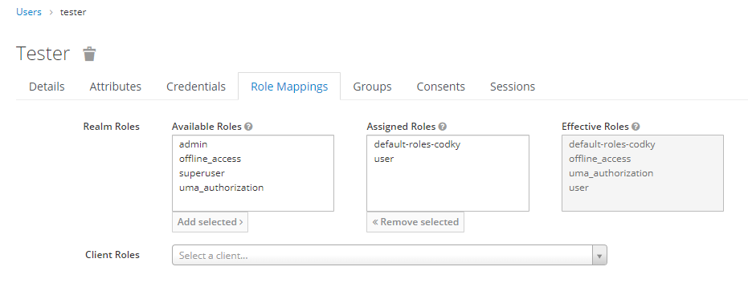
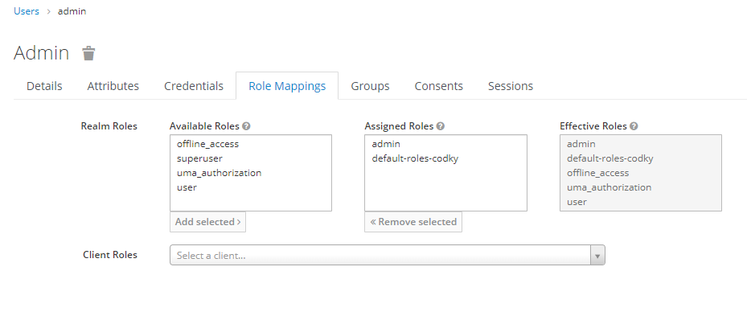
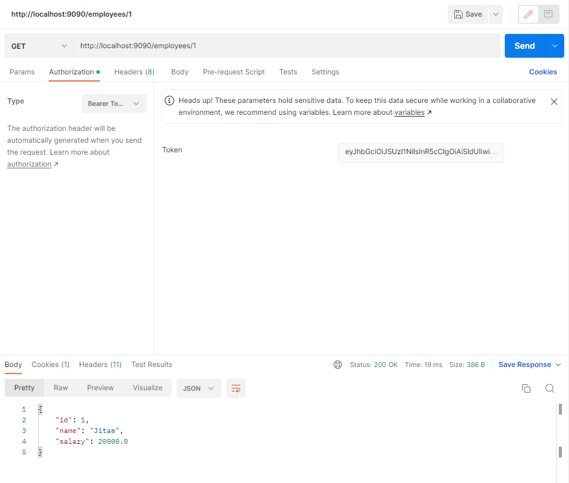
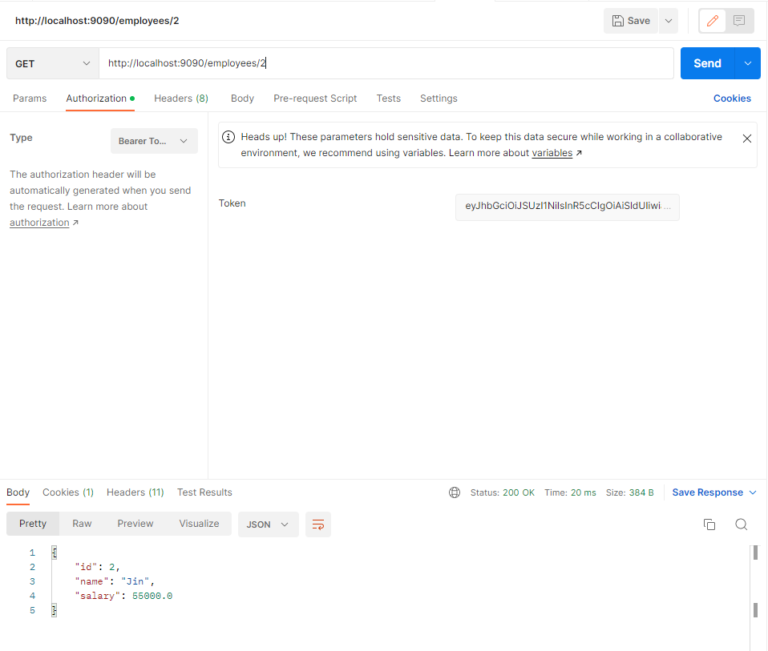
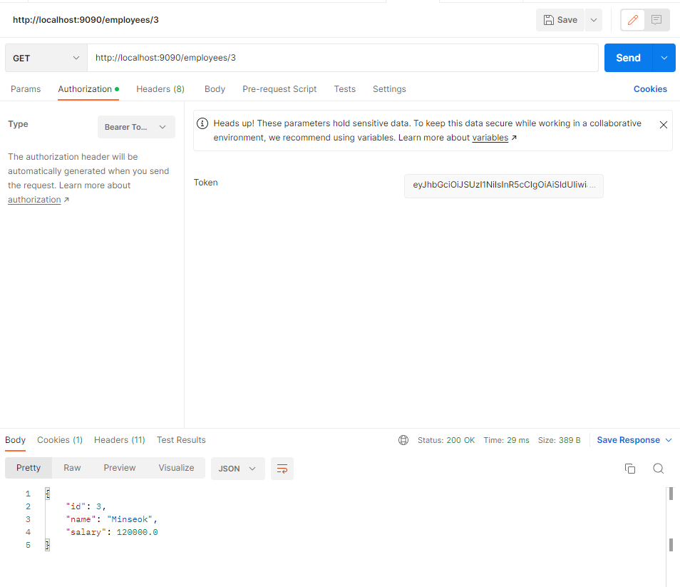
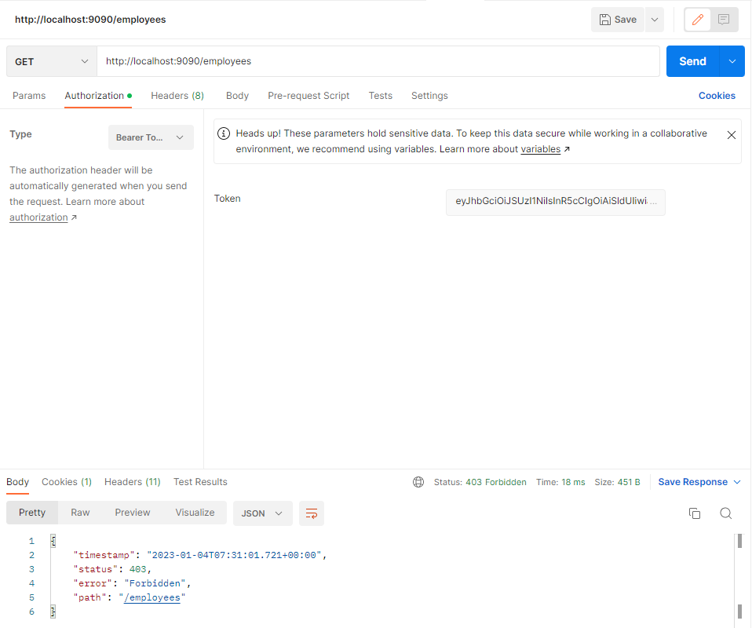
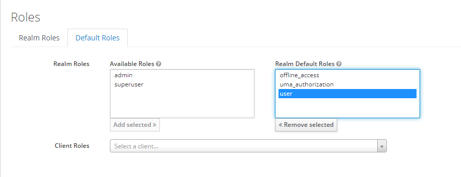
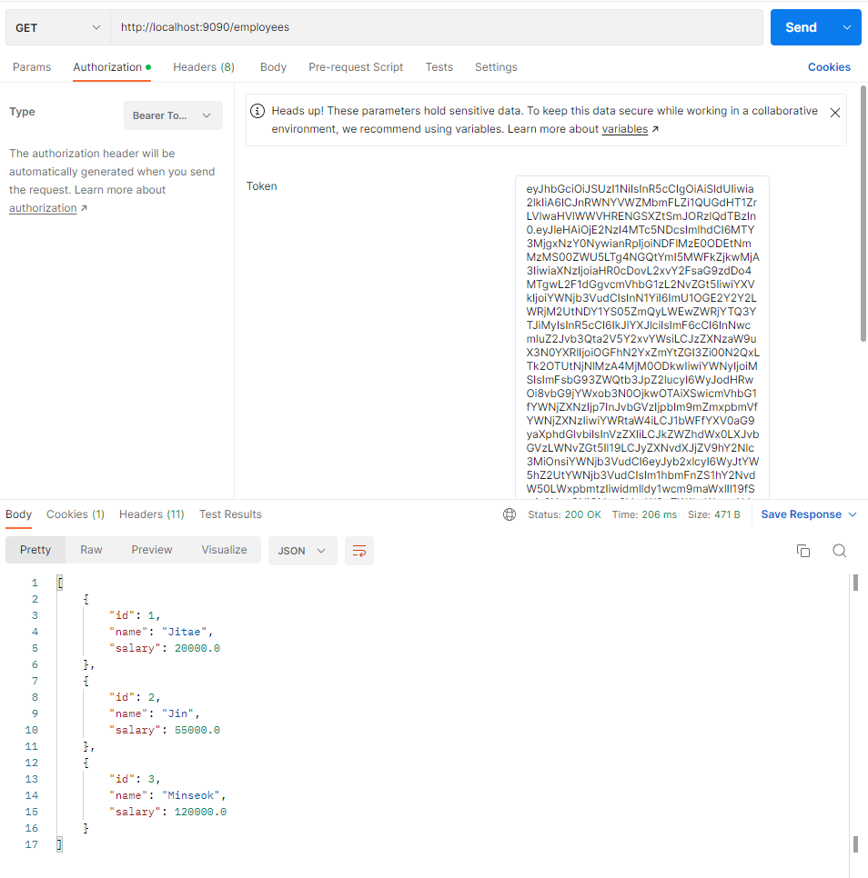
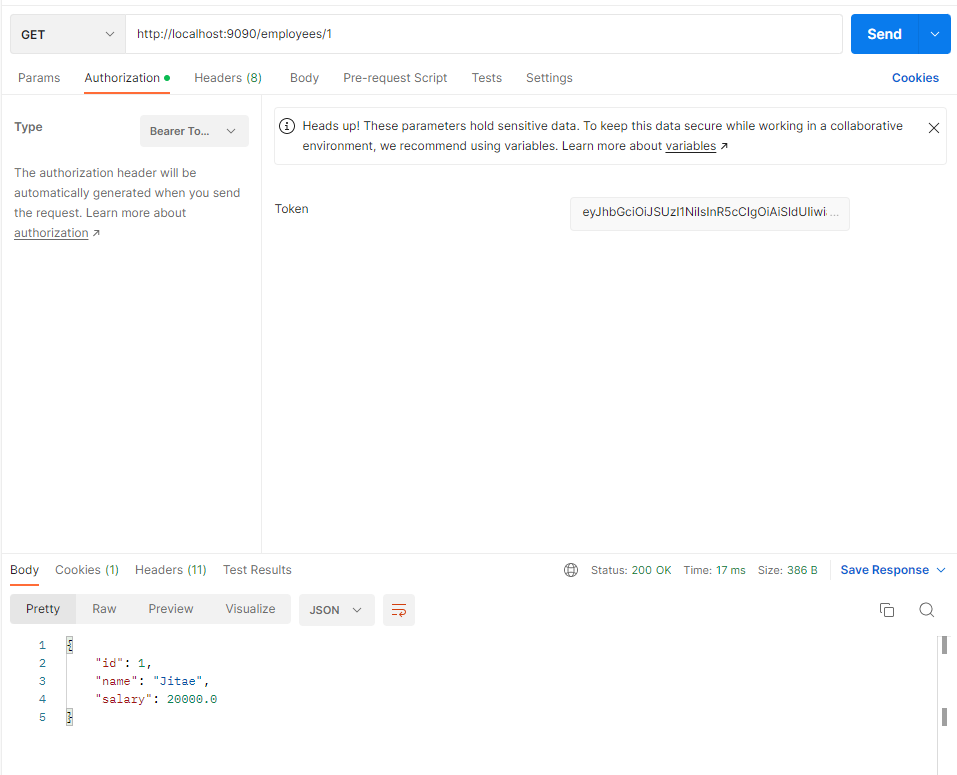

# SpringBoot + Security + JPA + Keycloak 

# Example
## tester: assigned roles 'user' 

## admin: assigned roles 'admin'

## role: user
### 200 OK

### 200 OK

### 200 OK

### 403 Forbidden

## Configure Realm Default Roles

## role : admin
### 200 OK

### 200 OK

